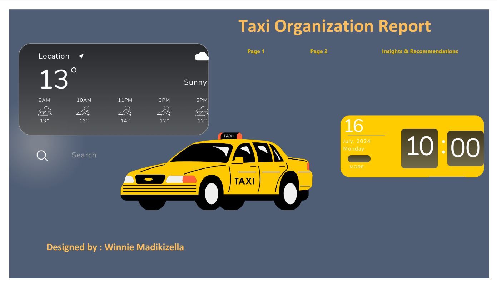
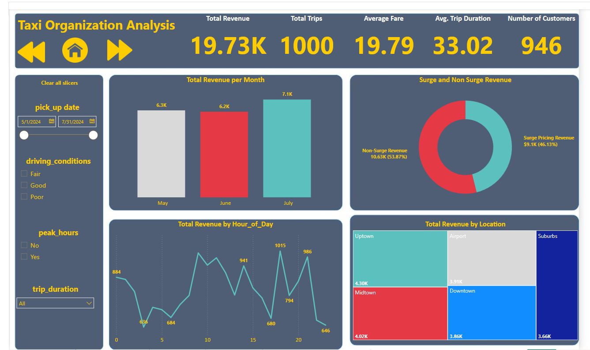
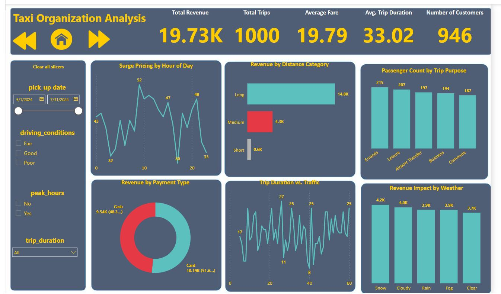

# Taxi-Organization-Analysis---Power-BI-Dashboard

## Overview
A comprehensive Power BI dashboard analyzing taxi service operations over three months (May-July 2024). This project identifies key revenue patterns, trip behavior, driver efficiency, and external impacts (weather, surge pricing) while providing data-driven recommendations to optimize performance. The interactive dashboard enables stakeholders to make informed decisions to enhance operations and customer experience.

Data Source: All taxi operation data analyzed in this project was provided by myDataClique.

## Dashboard Features
- Executive Summary with KPIs: Key performance indicators (KPIs) such as total revenue, total trips, average fare, and passenger count.
- Revenue Analysis: Breakdown by time, location, surge pricing, and payment type.
- Customer Segmentation & Trip Purpose Analysis: Identifies everyday trip purposes and passenger behavior.
- Weather & Traffic Impact Metrics: Evaluate how external factors influence trip duration and revenue.
- Driver Efficiency Metrics: Performance assessment based on trip frequency, average trip time, and revenue contribution.

## Key Insights
### Revenue Patterns
- Growing Monthly Revenue: Revenue increased from $6.3k in May to $7.1k in July, indicating seasonal trends or operational improvements.
- Peak Operating Hours: Highest revenue recorded at 6 PM ($1,014), 10 AM ($945), and 2 PM ($941), aligning with commuter and lunchtime demand.
- Geographic Revenue Distribution: Uptown leads in revenue ($4.30k), while Suburbs contribute the least ($3.66k).

### Operational Insights
- Surge Pricing Contribution: Non-surge trips account for 53.87% of total revenue, while surge trips contribute 46.13%.
- Trip Distance Impact: Long-distance trips generate 75% of total revenue ($14.8k), with short trips contributing only 3% ($0.6k).
- Payment Preferences: Card payments (51.64%) slightly surpass cash transactions (48.36%).
- Weather Influence: Snow conditions yield the highest revenue ($4.2k), showing increased taxi demand in adverse weather.
- Trip Purposes: Errands (215 trips) and leisure (207 trips) are the most common purposes.

## Data Analysis Methods
- Time Series Analysis: Evaluates revenue trends over months, days, and hours.
- Geographic Segmentation: Assesses revenue distribution across service areas.
- Conditional Formatting: Highlights performance variations.
- DAX Measures: Implements advanced calculations for trip duration, revenue distribution, and driver performance.

## Technical Implementation
- Custom DAX Formulas: Used for trip duration calculations, revenue segmentation, and driver efficiency analysis.
- Conditional Columns: Implemented for trip categorization and fare type differentiation.
- Interactive Filters: Allows users to explore data dynamically across multiple dimensions.
- Cohesive Color Scheme: Enhances visual storytelling for better decision-making.

## Screenshots
### Dashboard Overview

### Revenue Analysis

### KPI Tracking

## Tools Used
- Microsoft Power BI
- DAX (Data Analysis Expressions)
- CSV data processing

## Strategic Recommendations
### Revenue Optimization
- Refined Surge Pricing: Adjust surge pricing for peak hours (6 PM, 10 AM, 2 PM) to maximize revenue.
- Long-Distance Promotion: Implement discounts or loyalty programs for frequent long-distance travelers.
- Weather-Based Pricing: Slightly increase rates during clear weather to balance demand.

### Operational Improvements
- Fleet Allocation: Increase vehicles in Uptown and Midtown during peak hours.
- Trip Duration Optimization: Improve routes for common 30-35 and 55-60 minute trips.
- Digital Payment Adoption: Offer incentives for card payments to reduce cash handling costs.

### Customer Experience Enhancement
- Business Client Packages: Introduce corporate travel packages to serve business travelers (194 passengers).
- Premium Airport Transfers: Offer guaranteed service and fixed pricing for airport transfers (197 passengers).
- Weather Readiness Program: Market reliable service during adverse weather conditions.

### Strategic Growth Initiatives
- Expand Early Morning Service: Target the underperforming 6-8 AM segment ($684-$794 revenue) to capture commuters.
- Short Trip Profitability: Optimize routes and driver incentives for better efficiency in short trips.
- Seasonal Planning: Prepare for continued revenue growth in summer months with temporary fleet expansions.

## Future Enhancements
- Real-Time Data Integration: Incorporate live trip data for up-to-date analysis.
- Predictive Analytics: Develop models for demand forecasting and revenue projections.
- Driver Performance Optimization: Implement driver scoring and efficiency tracking.
- Customer Loyalty Analysis: Measure the impact of retention programs on revenue.
